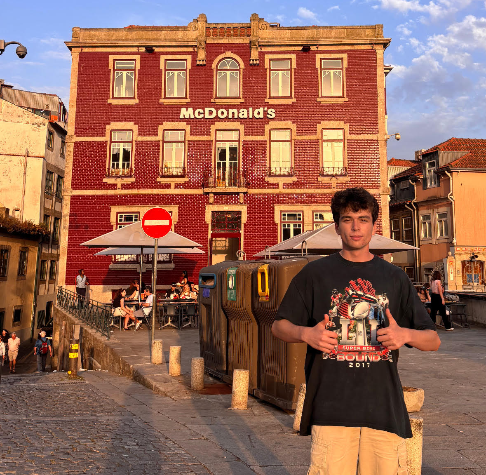

Home | [About Me](about.html) | [Resume](resume.html) | [Career Goals](goals.html) | [Technical Projects](projects.html)

---

# Welcome

Hello, I'm Xavier Werth. I am a motivated Computer Engineering student at Georgia Tech seeking a Summer 2026 Robotics and Autonomous Systems Internship. I have hands-on experience in embedded systems, computer vision, and software development. I am eager to apply interdisciplinary skills in perception, controls, and data-driven analysis to build reliable, real-world autonomous technologies.

  
Click to see a picture of me!

  

